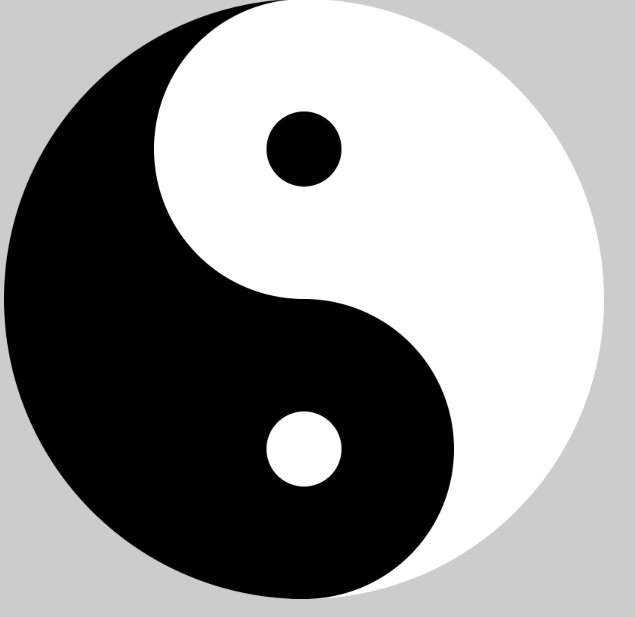

# 开始 #


canvas 的文档说明： 包括画线等
http://www.w3school.com.cn/tags/html_ref_canvas.asp

## 画布 ##

```
<body>

  <canvas width="500" height="300" id="c"></canvas>

</body>

```


## 画线 ##

```
//创建一个画布
var canvas = document.getElementById("c");

//获取一只画笔
var paint = canvas.getContext("2d");

paint.strokeStyle = "black";

paint.beginPath();
paint.lineTo(0,0);
paint.lineTo(100,100);
paint.stroke();

```

定义和用法
lineCap 属性设置或返回线条末端线帽的样式。
注释："round" 和 "square" 会使线条略微变长。

---------

## 弧线 ##

arc
x	圆的中心的 x 坐标。
y	圆的中心的 y 坐标。
r	圆的半径。
sAngle	起始角，以弧度计。（弧的圆形的三点钟位置是 0 度）。
eAngle	结束角，以弧度计。
counterclockwise	可选。规定应该逆时针还是顺时针绘图。False = 顺时针，true = 逆


```
//获取一只画笔
var paint = canvas.getContext("2d");

paint.fillStyle="red";
	//开始画圆
paint.beginPath();
// 参数一，参数二：圆点  参数三：半径 参数四：开始的角度  参数五：结束的角度  参数六：画的顺序
paint.arc(x, y, 10, 0, Math.PI * 2, false);
paint.closePath();

//设置圆为实心的
paint.fill();
```

## 矩形 ##

```
context.strokeRect(origin.x,origin.y,size.width,size.height);

context.fill();
```


## 文字 ##


```
context.restore();
context.fillText(text,origin.x,origin.y,maxWidth);
```


## 图片 ##

drawImage
img	规定要使用的图像、画布或视频。
sx	可选。开始剪切的 x 坐标位置。
sy	可选。开始剪切的 y 坐标位置。
swidth	可选。被剪切图像的宽度。
sheight	可选。被剪切图像的高度。
x	在画布上放置图像的 x 坐标位置。
y	在画布上放置图像的 y 坐标位置。
width	可选。要使用的图像的宽度。（伸展或缩小图像）
height	可选。要使用的图像的高度。（伸展或缩小图像）

```
var image = new Image();
image.src = imagePath;
image.onload = function () {
    context.drawImage(image,cutOrigin.x,cutOrigin.y,cutSize.width,cutSize.height,origin.x,origin.y,size.width,size.height);
}
```

## 清除区域图像 ##

```
//清除 绘制的内容
//x,y原点
//w,h清除区域的宽度 和高度
context.clearRect(100,100,700,700);
```

# 粒子效果小案例 #

## 页面宽度和高度 ##

```
window.innerWidth 获取页面的宽度
window.innerHeight 页面的高度
```

# 画笔案例 #

## 基础知识 ##

### 事件坐标 ###

clientX/Y获取到的是触发点相对浏览器可视区域左上角距离，不随页面滚动而改变

pageX/Y获取到的是触发点相对文档区域左上角距离，会随着页面滚动而改变

兼容性：除IE6/7/8不支持外，其余浏览器均支持

---------

### 改变线的颜色 ###

```
var lineColor = document.querySelector(".lineColor");

lineColor.onchange = function () {
    painter.setLineColor(this.value);
}

```

### 鼠标的图形形状 ###

```
// css 中配置
cursor: crosshair;

// js 来配置
self.target.style.cursor = "crosshair";


```

完整的鼠标图形说明
http://www.w3school.com.cn/cssref/pr_class_cursor.asp


# 太极图形 #

画弧度，画圆形


